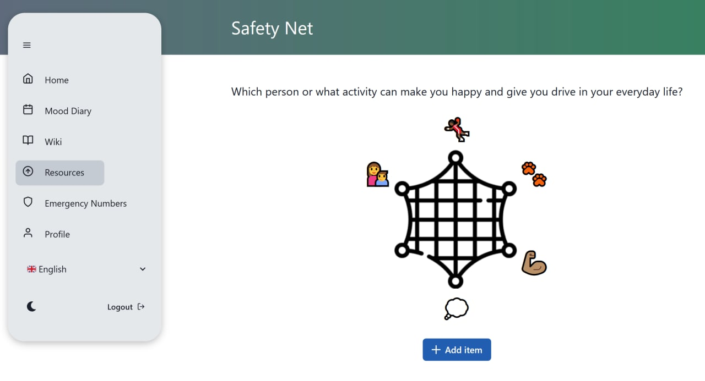
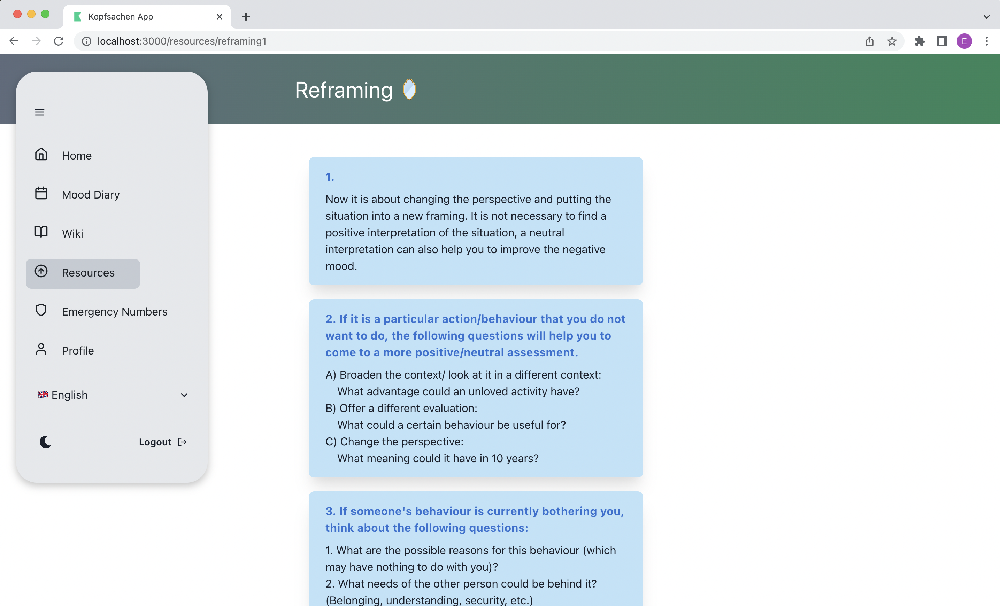
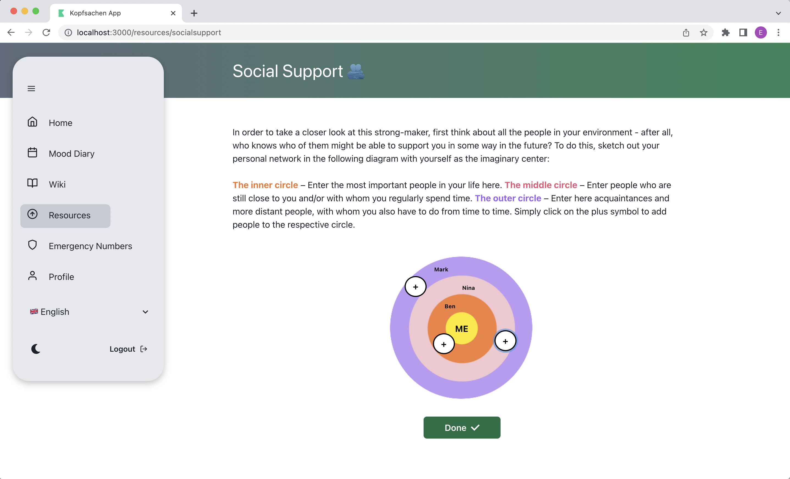
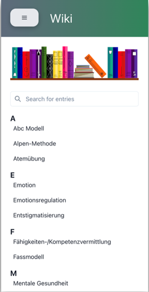
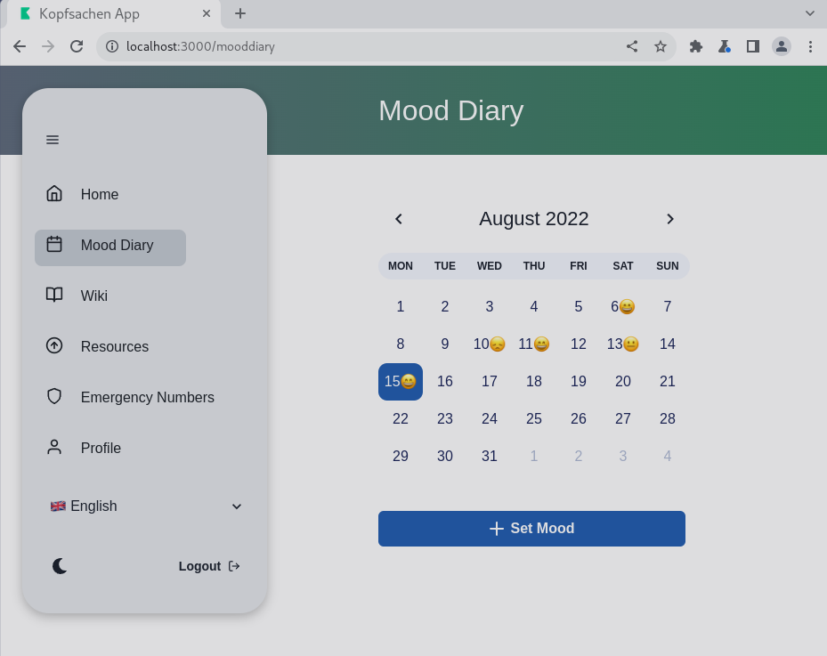
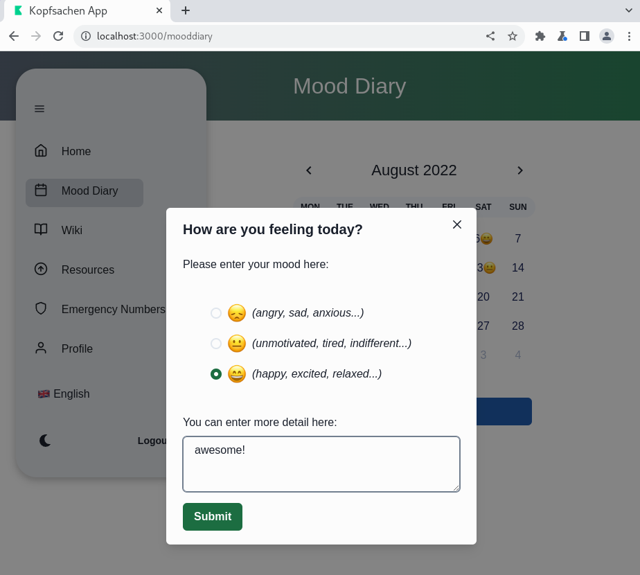
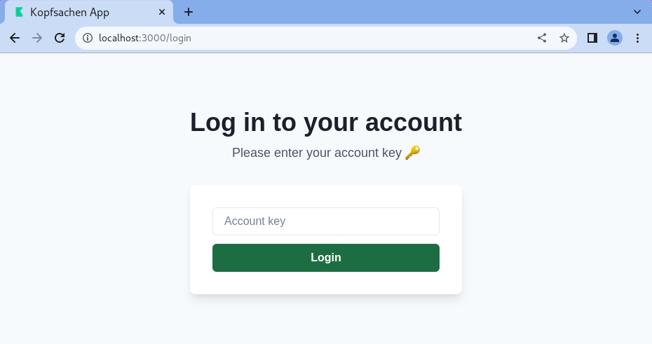
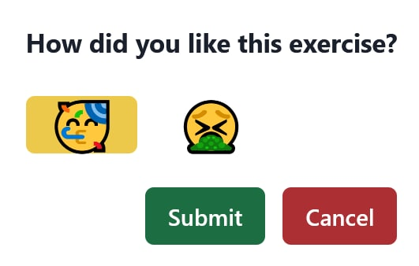

# Intro

`kopfsachen-app` is a web application created by Team Implemind, for Kopsachen, a mental health organization offering Workshops for teenagers. The web application brings Kopsachen's Workshops into the web stage, offering many different features and exercises for the user-base. It aims to help Kopfsachen in it's cause to make preventative mental health reachable to wider audiences.

# Technologies
In creating the web application, Typescript was used as the main language, and [ReactJS](https://reactjs.org/) as the main library. Furthermore, [ChakraUI](https://chakra-ui.com/), a React component library that offers accessible and user-friendly components, was used. The web-application covers the front-end of the whole application and communicates with the back-end via an API.

## React Router 
[React Router](https://reactrouter.com/en/main) is used to handle and define multiple routes in the web-app. This enables the user to surf through different pages, changing the URL, modifying the browser history and keep the UI state in sync rather than reloading the entire page. This leads to more responsiveness and a better user quality.

# Features

## Resources

### Safety Net

One of the exercises is the Safety Net. This exercise has to be done once in the registration process and can as well be done later on. The Safety Net is a collection of people and things that are important to the user and help them in their everyday life. The user should be able to add items to the net, assign one of the given categories to them and enter ways in which this item (person, activity...) helps them.

In order to enable the user to add items to the safety net we needed to implement API requests (get, post). To handle user input we used html forms and for the post request we used the axios library.

Kopfsachen provided a picture for us that should depict the safety net and around which the categories should be arranged. It was not too easy to find out how to arrange items in a circle around a picture in CSS but eventually we managed it with the help of a Sass mixin that uses chained CSS transforms. We found it here: [Sass feature](https://css-tricks.com/snippets/sass/placing-items-circle/).


*Safety net*

In general, an important tool to create a responsive/dynamic website with React is the so called Hook which is a special function to control the React features of your website. The one we used the most is the `useState` Hook that lets you assign and change the state of a React component. With its help we check, for example, if a button has been clicked or we keep track of user input. If you want your Website to get user input, you use the Input component from React. Respectively, there are React components for all the UI elements such as buttons, modals, links and texts to which you can assign different properties.

The following code example shows a `useSate` Hook as well as a React Button with several properties. You can also see that we used the Hook in the `onClick` property of the button, which defines what should happen when the button has been clicked.

```jsx
const [addItemClicked, setAddItemClicked] = useState(false);
<Button
    mt={5}
    mb={mobile ? '25px' : 'unset'}
    colorScheme="primary"
    aria-label="Add item"
    leftIcon={<AddIcon />}
    onClick={() => setAddItemClicked(true)}
>
    Add item
</Button>
```

### Reframing

Reframing is yet another resource which the user can complete. It helps the user to asses a situation that is burdening from different perspectives. In going through it, the exercise aims to help the user re-frame their thoughts and lead to a healthier conclusion. On the first page of the exercise an informational video by Kopfsachen is displayed. Then the users are asked to enter 4 situations which are making them busy at the moment. And lastly, the user is asked to go through these situations while answering the questions that help asses the situations in a better way. 


*Reframing Screen*

### Social Support

Furthermore there is an resource called Social support. It helps the users to visualize their social circle. The user enters the 1st, 2nd, and 3rd layers of people who are close to them, which are then placed onto a circle with 3 different colors. 


*Social Support Screen*

### Optimism

The final resource users can try out is the one called Optimism. Like every other resource you can decide later on if you want to integrate it on your resources catalog or if you don’t find it helpful and would rather move on and discover new ones. Optimism requires setting a 10-minute timer in which the user thinks of scenarios where their life is as they have always imagined it. After playing this scenario out you can write all the thoughts and emotions that came up during the 10 minutes without worrying too much about the grammar or semantics.

## Wiki


*Wiki Screen (mobile view)*

Another feature of the app is the Wiki, which is a collection of mental health and psychology related terms that the user can look up. It should have a search function, the titles should be displayed in an alphabetically ordered list and every title should lead you to the respective entry.
In our implementation we made sure that all the entries get fetched once the Wiki page is being loaded using an `useEffect` Hook. With the use of an effect Hook you can define what should happen with your components after rendering. The search function we implemented using a filter function - that we call on our list of sorted Wiki entries - which takes a function as an input that defines which elements should be left in the list.

The following code example shows the effect hook mentioned above. In this example you can also see a useful feature of Typescript, as we use typisation in form of an interface to control/mark that the format of the Wiki api response.

```tsx
useEffect(() => {
    [...]
    const fetchEntriesWrapper = async () => {
      const fetchEntries = await fetch(`/wiki`);
      if (fetchEntries.ok) {
        const entriesData: IWikiResponse = await fetchEntries.json();
        if (entriesData.entries.length > 0) {
          setEntries(entriesData.entries.sort(sortEntriesByTitle)); // sort entries by title before storing
        }
      } else {
        console.log("Failed to fetch wiki entries.");
      }
    };
    fetchEntriesWrapper();
  }, []);
```

## Emergency Numbers

Kopfsachen also offers external help featuew for emergency cases. You can choose between three different crises lines and contact them by phone, email and chat. Through personal consultation you can discuss your problems or ask questions on different topics, participate in forums, group chats by staying anonymos and keeping your data private. They all operate in different hours throughout the day so there is always someone you can contact at any time of the day.

## Mood Diary

The mood diary is one of the central features of the app. Here users can enter their current mood and keep track of the different mood over time. When pressing `+ Set Mood`, the user can choose one of the emojis, representing their mood as well as add a description for it. 


*Mood Diary Screen*


*Mood Diary Enter Mood Prompt*

When submitting a mood, the application will automatically re-fetch the mood diary to display the new entry.

## Authentication

The registration and login pages can be found at `/register` and  `/login`.


*Login Screen*

To enable a seemless experience for the user, a selection screen to go to either login or registration will appear, if the user is not authenticated. In contrast, when a logged-in user connects, the user is greeted with the regular home screen (without login and registration button).

This behaviour was made possible by using the [zustand](https://github.com/pmndrs/zustand) library. Zustand is a light-weight and minimalistic state-management solution.

Whenenver the user logs in or out, the isLoggedIn state is updated. We can then use this variable to decide what items should be displayed. The following code snippet contains an example of how the is isLoggedIn state is accessed.

```jsx
import { useStore } from "../src/store/isLoggedIn";
[...]
<Button
  display={useStore((state) => state.isLoggedIn) ? "none" : ""}
  colorScheme="primary"
  mt={3}
>
  Register
</Button>
```
*example of zustand*

Zustand's [Persist middleware](https://github.com/pmndrs/zustand#persist-middleware) enables us to save the state, even if the user decides to close the tab or browser.

# Accessibility

## Mobile compatibility

In order to make our Web app as accessible as possible we have realized mobile compatibilty. We found a very nice solution on the github of a friend which uses a custom Hook to toggle between normal and mobile view: [Custom Hook for mobile compatibility](https://github.com/Nik-Sch/Rezeptbuch/blob/server/ui/client/src/components/helpers/CustomHooks.tsx#L27)
It works as follows: With the help of an effect Hook and an event listener the `useWindowDimensions()` function keeps track of the window dimensions. These dimensions are then passed to the `useMobile()` function which returns a boolean for respective window sizes. Eventually, we use the `useMobile()` function as a `useState` Hook to switch to mobile view if necessary. For the mobile view we defined different sizes, distances, margins and so on for the components.

Here you can see the custom hook for the mobile view:
```jsx
[...]
export function useWindowDimensions() {
  [...]
  useEffect(() => {
    function handleResize() {
      setWindowDimensions(getWindowDimensions());
    }

    window.addEventListener("resize", handleResize);
    return () => window.removeEventListener("resize", handleResize);
  }, []);

  return windowDimensions;
}

export function useMobile() {
  const { width, height } = useWindowDimensions();
  return width <= 815 || height <= 650;
}
```

## Internationalization
Internationalization is one of the main focuses of the web-app. For the app to reach wider audiences, language support is key. For that the code-base should be designed in an efficient way in which languages can be added easily.
 
 The default language of the app is english, however we localized the sidebar and one of the resources (Safety Net) in german, turkish and albanian to see the localization process come into play. To achieve this, the [i18next](https://www.i18next.com/) library was used. 


Furthermore, all the localized components are also internationalized, which means we have adapted our code for Kopfsachen, so that it can easily be modified and adapted into other languages.This means that, if Kopfsachen wants to branch out later and add other languages, they wouldn’t require engineering changes to the source code. This is done by separating the content that needs translation from our code base and added it to a new translation file. Instead of the static text the function t() is called with the label "addResource" `{t("addResource")}`.
This label corresponds to this line in the translation file:`addResource: "Add another resource",` in English and `addResource: "Baska bir kaynak ekle",` in Turkish. This meands hard coded strings are replaced with a key value or identifier in this file and value is taken based on the translated value of the local that the user has switch to on the app.


The following code snippet contains an example of some strings localized in turkish.

```jsx
export const translationsTr = {
    //SafetyNet-----------------
    welcome:
    "Hangi insan veya aktiviteler seni mutlu yapiyor ve günlük hayatinda güç veriyor?",
    happyMaker: "Bunlar beni mutlu eden seyler:",
    chooseCategory: "Bu kaynak hangi kategoriye ait?",
    chooseWays: "",
    chooseWays2: " sana şuanda hangi üç farklı metod ile yardım edebilir:",
```

# Accessibility
## Dark mode

Another step towards accesibilty and smoother use experience was Chakra UI which allows users of diverse abilities navigate, understand and use our UI.
Chakra includes keyboard navigation and provides a dark mode which helps decrease eye strain in low-light settings and people with light sensitivity or visual impairment. This button can be found on the lower left of the sidebdar.


This code snippet demonstrates how we switched from light to dark mode

```jsx


    type ColorModeSwitcherProps = Omit<IconButtonProps, "aria-label">
    

    export const ColorModeSwitcher: React.FC<ColorModeSwitcherProps> = (props) => {
      const { toggleColorMode } = useColorMode()
      const text = useColorModeValue("dark", "light")
      const SwitchIcon = useColorModeValue(FaMoon, FaSun)
    

      return (
        <IconButton
          size="md"
          fontSize="lg"
          variant="ghost"
          color="current"
          marginLeft="2"
          onClick={toggleColorMode}
          icon={<SwitchIcon />}
          aria-label={`Switch to ${text} mode`}
          {...props}
        />
      )
    }

```


Another step towards accesibilty and smoother use experience was Chakra UI which allows users of diverse abilities navigate, understand and use our UI.
Chakra includes keyboard navigation and provides a dark mode which helps decrease eye strain in low-light settings and people with light sensitivity or visual impairment. This button can be found on the lower left of the sidebdar.


This code snippet demonstrates how we switched from light to dark mode

```jsx
	type ColorModeSwitcherProps = Omit<IconButtonProps, "aria-label">
	

	export const ColorModeSwitcher: React.FC<ColorModeSwitcherProps> = (props) => {
	  const { toggleColorMode } = useColorMode()
	  const text = useColorModeValue("dark", "light")
	  const SwitchIcon = useColorModeValue(FaMoon, FaSun)
	

	  return (
	    <IconButton
	      size="md"
	      fontSize="lg"
	      variant="ghost"
	      color="current"
	      marginLeft="2"
	      onClick={toggleColorMode}
	      icon={<SwitchIcon />}
	      aria-label={`Switch to ${text} mode`}
	      {...props}
	    />
	  )
	}

```

## Color Usage

We thought it would be a good idea to structure/reduce the usage of color on our website. As React is themable, we defined new color schemes and when to use them. Therefore, we overwrote some color schemes from React with the core colors from blueprint: [blueprint](https://blueprintjs.com/docs/#core/colors). These colors adhere to the WCAG 2.0 standards and thus they can be simply combined without interfering accessibility. We defined red to be used in use cases of warning (such as canceling operations), green in case of success (e.g. submitting actions) and blue as the primary color.


*Rating exercises prompt*

This code snippet demonstrates how we extended the color scheme:

```jsx
import { extendTheme } from "@chakra-ui/react"

export const theme = extendTheme({
    colors: {
        success: { //green
            50: "#72CA9B",
            [...]
            300: "#32A467",
            [...]
            800: "#165A36",
            900: "#165A36"
        },
        [...]
    },
})
```

# Setup / How To Install

To run the app, please first clone this repository:

```bash
git clone https://github.com/TUBerlin-Kopfsachen-Browser-Frontend/kopfsachen-app.git  && cd kopfsachen-app
```

Since some parts of the application are not currently connected to the backend server, it is recommendet to run a mockserver:

```bash
npm install -g @stoplight/prism-cli
prism mock -d complete.yaml
```

Now all that is left, is to install the dependencies and start the server:

```bash
npm i
npm start
```

The application will be running on `http://127.0.0.1:3000/`.

Please keep in mind that certain parts of the application rely on the backend server to run (e.g. authentication). Additionaly, the application currently uses a local proxy to mitigate CORS errors. For deployment, the `src/setupProxy.js` should be removed.
